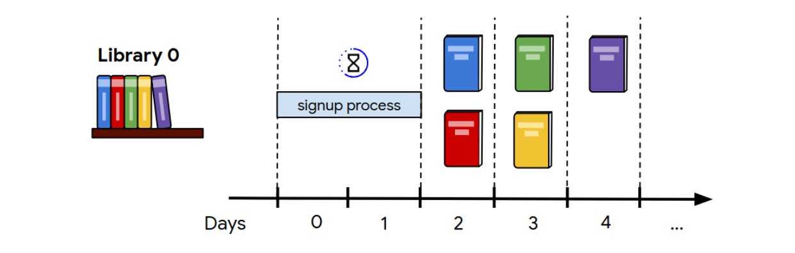
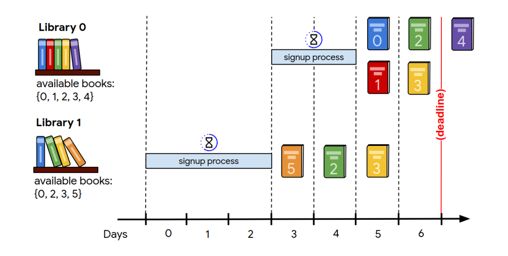

# HASH CODE 2020 - Book Scanning
Problem statement for the Online Quali cation Round of Hash Code 2020

## Introduction
Books allow us to discover fantasy worlds and be er understand the world we live in.
They enable us to learn about everything from photography to compilers... and of
course a good book is a great way to relax!

Google Books is a project that embraces the value books bring to our daily lives. It
aspires to bring the world's books online and make them accessible to everyone. In the
last 15 years, Google Books has collected digital copies of 40 million books in [more
than 400 languages](/https://www.blog.google/products/search/15-years-google-books/), partly by scanning books from libraries and publishers all around
the world.

In this competition problem, we will explore the challenges of setting up a scanning
process for millions of books stored in libraries around the world and having them
scanned at a scanning facility.

## Task
Given a description of libraries and books available, plan which books to scan from
which library to maximize the total score of all scanned books, taking into account that
each library needs to be signed up before it can ship books.

## Problem description
### Books
There are **B** different books with IDs from 0 to **B**–1. Many libraries can have a copy of
the same book, but we only need to scan each book once. Each book is described by
one parameter: the score that is awarded when the book is scanned.

### Libraries
There are **L** different libraries with IDs from 0 to **L**–1. Each library is described by the
following parameters:

- the set of **books** in the library,

- the **time** in days that it takes to sign the library up for scanning,

- the **number of books that can be scanned each day** from the library once the
library is signed up.

### Time
There are **D** days from day 0 to day **D**–1. The first library signup can start on day 0. **D**–1
is the last day during which books can be shipped to the scanning facility.

### Library SignUp
Each library has to go through a **signup process** before books from that library can be
shipped. Only one library at a time can be going through this process (because it
involves lots of planning and on-site visits at the library by logistics experts): the signup
process for a library can start only when no other signup processes are running. The
libraries can be signed up **in any order**.

Books in a library can be scanned as soon as the signup process for that library
completes (that is, on the first day immediately a er the signup process, see the figure
below). Books can be scanned in parallel from multiple libraries.

******
For **example**, if 
- the signup process for library 0 (that is, the library with ID 0) takes 2 days, and
- the signup process for library 1 takes 3 days, and
- library 1 is signed up before library 0

then
- the signup process of library 1 starts on **day 0** , and finishes on **day 2** (3 days in
total)
- the first books from library 1 can be scanned starting on **day 3** (the next day
after the signup process finishes)
- the signup of library 0 starts on **day 3** (the next day after the signup process
of library 0 is done) and finishes on **day 4** (2 days in total)
- the first books from library 0 can be scanned starting on **day 5** (the next day
after the signup process finishes)

**Figure.** The signup process (blue bars) and the books being scanned from each
library per day. Only one library can be in the signup process at a time, but books can
be shipped in parallel by multiple libraries.

******
### Scanning
All books are scanned in the scanning facility. The entire process of sending the books,
scanning them, and returning them to the library happens in one day (note that each
library has a maximum number of books that can be scanned from this library per day).
The scanning facility is big and can scan any number of books per day.
*****
For **example**, if library 0 has 5 books, can ship 2 books per day, and completes the
signup process on day 1, then:

- 2 books can be scanned on day 2
- 2 books can be scanned on day 3
- the one remaining book can be scanned on day 4

*****
## Input Data Set
### File format
Each input data set is provided in a plain text file. The file contains only ASCII
characters with lines ending with a single '\n' character (also called “UNIX-style” line
endings). When multiple numbers are given in one line, they are separated by a single
space between each two numbers.

The first line of the data set contains:

- an integer **B** ( 1 ≤ **B** ≤ 10^5 ) – the number of di erent books,

- an integer **L** ( 1 ≤ **L** ≤ 10^5 ) – the number of libraries,

- an integer **D** ( 1 ≤ **D** ≤ 10^5 ) – the number of days.

This is followed by one line containing **B** integers: **S(0)** , ... , **S(B-1)** , (0 ≤ **S(i)** ≤ 10^3 ), describing
the score of individual books, from book 0 to book **B–1**.

This is followed by **L** sections describing individual libraries from library 0 to library **L–1**.
Each such section contains two lines:

- the first line, which contains:

  ○ **N(j)** ( 1 ≤ **N(j)** ≤ 10^5 ) – the number of books in library **j** ,

  ○ **T(j)** ( 1 ≤ **T(j)** ≤ 10^5 ) – the number of days it takes to finish the library signup
process for library **j** ,

  ○ **M(j)** ( 1 ≤ **M(j)** ≤ 10^5 ) – the number of books that can be shipped from library **j**
to the scanning facility per day, once the library is signed up.

- the second line, which contains **N(j)** integers, describing the IDs of the books in
the library. Each book ID is listed at most once per library.

The total number of books in all libraries does not exceed 10^6 .

### Example

**Note that the example input above contains extra blank lines for clarity, no input
file in the Judge System contains blank lines.**

## Submission
### File format
Your submission describes which books to ship from which library and the order in
which libraries are signed up.

The submission le must start with a line containing the integer **A** ( 0 ≤ **A** ≤ **L** ) – the
number of libraries to sign up (you don't need to sign up all libraries – the ones you skip
are just ignored and no books are scanned from them).

Then, the submission le must describe each library, **in the order** that you want them
to start the signup process . The description of each library must contain two lines:

- the first line containing:

  ○ **Y** ( 0 ≤ **Y** ≤ **L** – 1) – the ID of the library,

  ○ **K** ( 1 ≤ **K** ≤ **N(Y)**) – the number of books to be scanned from library **Y** .

- the second line containing the IDs of the books to scan from that library: **k(0)** , ... ,
**k(K-1)** , (0 ≤ **k(i)** ≤ **B**–1) in the order that they are scanned, without duplicates.

Each library must be described only once.

Note that:

- You don’t need to scan all books from a library you describe.
- If a library signup process finishes after **D** days, its description will be ignored.
- Books shipped after **D** days will be ignored.

**Note** that though you describe the libraries one after another in the order by
which signup processes are sta ed, the actual scanning of the books happens in
parallel for all libraries that are already signed up and still have remaining books to
scan.

### Example

## Scoring
Your score is the sum of the scores of all books that are scanned within D days. Note
that if the same book is shipped from multiple libraries (as books 2 and 3 are in the 
figure below), the solution will be accepted but the score for the book will be awarded
only once.

**Figure.** Based on the input data set and the submission from the previous sections,
books 0, 1, 2, 3, and 5 are scanned by Day 6, and the total score is 16.
*****
The **example** submission results in this timeline:

- **Day 0 to day 2** : signup process for library 1.
- **Day 3** : book 5 from library 1 is scanned, signup process for library 0 starts.
- **Day 4** : book 2 from library 1 is scanned, signup process for library 0 finishes.
- **Day 5** : book 3 from library 1 is scanned, books 0 and 1 from library 0 are
scanned (library 0 can process two books per day).
- **Day 6** : books 2 and 3 from library 0 are scanned.

In the end, book 0, book 1, book 2, book 3 and book 5 are scanned. Their scores are 1,
2, 3, 6, and 4, respectively. Which results in a total score of **16** .

Note that book 2 and book 3 are scanned twice, but their scores are still only
counted once. Also, note that no score is assigned for book 4, as it is scanned after
Day 6
*****
**Note that there are multiple data sets representing separate instances of the
problem. The final score for your team will be the sum of your best scores for the
individual data sets.**
